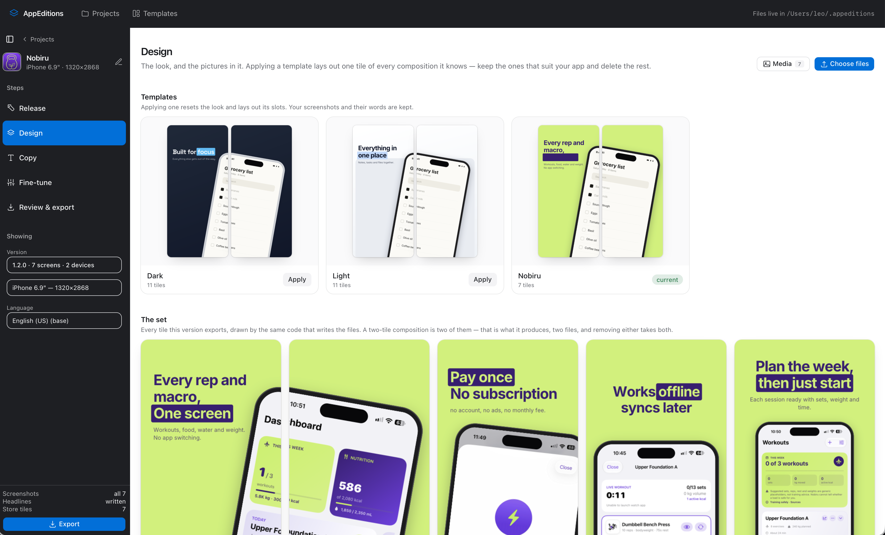
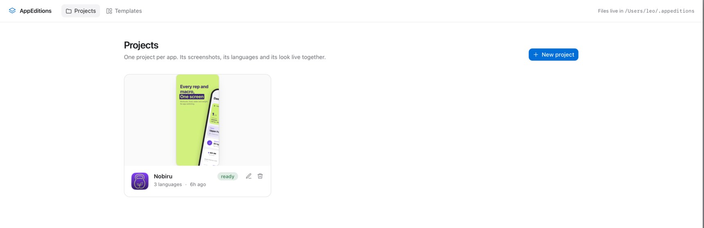
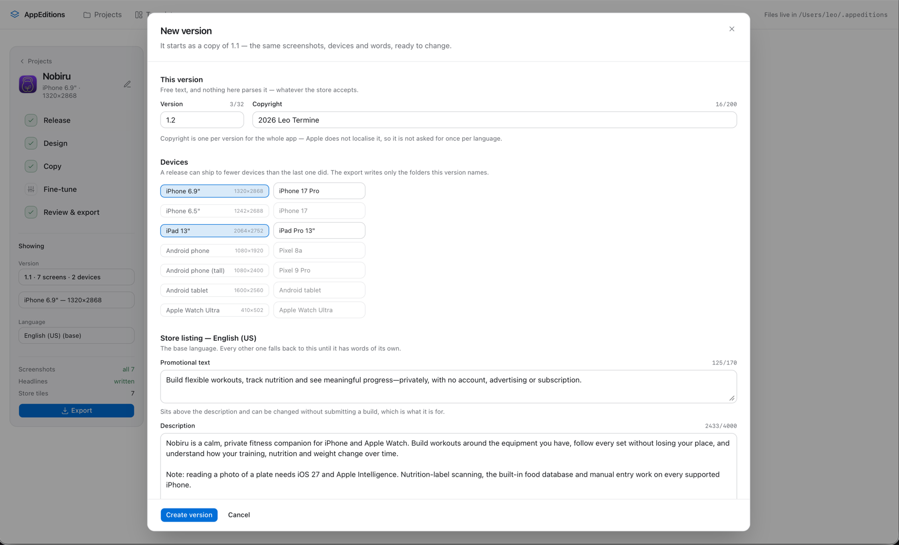

<h1 align="center">AppEditions</h1>

<p align="center">
  Turn raw app screenshots into store-ready App Store and Google Play assets —
  in every language you ship in.<br>
  A local desktop app. No account, no upload, no server: the images never leave
  your machine.
</p>

---

Drop your simulator captures in, pick a look, write a headline per screen, and
get one folder of correctly-sized PNGs per language. It tells you at every point
what is still missing before the set can be uploaded.

<p align="center">
  <br>
  <em>The set — every tile this version exports, drawn by the same code that
  writes the files. What you are looking at is a PNG the app rendered, not a
  preview of one.</em>
</p>

<p align="center">
  <br>
  <em>One project per app. Its screenshots, its languages and its look live
  together.</em>
</p>

<p align="center">
  <br>
  <em>A new version starts as a copy of the last one. It owns its own screens,
  its own store slots and its own listing — a release can ship to fewer devices
  than the one before it.</em>
</p>

- **Projects that persist.** Screenshots are copied into the project's own
  directory and never modified again — every frame, crop and scale happens at
  render time, so next release is re-dropping the new captures, not redoing the
  work.
- **Every language, side by side.** A project ships in as many locales as you
  like. Each screen's copy is per-language, each language exports to its own
  folder, and a language with no words yet falls back to the one you write in
  rather than rendering blank.
- **Every device, from the same screens.** A project also ships to as many
  store slots as you like — iPhone 6.9", iPad 13", Android phone. The same
  screens and the same copy are drawn at each one's pixel size with the frame
  that belongs in it, and the export is the product: one folder per device per
  language.
- **Copy the machine can draft.** If you have `claude` or `codex` installed,
  AppEditions can write the whole set's headlines as a sequence, or carry them into
  another language. It writes a draft into the fields; you keep or replace it.
  Nothing is sent anywhere but the CLI you already have signed in.
- **Templates you own.** The looks that ship are seeded into the database, not
  compiled into the binary: duplicate one, edit it, or save the set you just
  tuned as a template and start next release from it.
- **Frames without artwork.** Devices are drawn from a geometric description —
  aspect, bezel, corner radius, cutout — so there are no bitmaps to ship, scale
  or license, and adding a phone is one row.
- **Panoramas and rhythm.** A composition can span two store tiles and gets
  sliced into consecutive PNGs on export. A rhythm varies the composition down
  the strip instead of ten identical tiles.
- **What you see is what ships.** The preview and the export are the same
  function at different sizes. There is no second renderer to drift.

## Run it

You need Go 1.27. Nothing else — the stylesheet is committed, and rebuilding
it uses Tailwind's standalone binary rather than a Node toolchain.

```bash
git clone https://github.com/mirairoad/appeditions.git && cd appeditions
make run        # builds, then opens the window
```

The window is WKWebView on macOS and WebKitGTK on Linux — the webview the OS
already ships, not a bundled runtime. `make serve` runs the same application as
a plain server on `:9010` if you would rather use a browser.

| Command | What it does |
| --- | --- |
| `make` | Generate routes and endpoints, build `./appeditions` |
| `make run` | The app, in its own window |
| `make dev` | The same, watched: rebuild, restart and reload in place on save |
| `make serve` | Just the server on `:9010`, for a browser |
| `make dev-web` | The watched loop without a window |
| `make test` | Go tests, including the renderer's visual dump |
| `make check` | The framework conventions, enforced |
| `make css` | Rebuild the stylesheet (fetches the pinned Tailwind binary) |

## Install it

If you only want the app, this builds it and cleans up after itself. Go and a C
toolchain are needed for the build; the installed app needs neither, so the
source is cloned to a temporary directory and deleted on the way out.

```bash
curl -fsSL https://raw.githubusercontent.com/mirairoad/appeditions/main/install.sh | sh
```

macOS gets `AppEditions.app` in `/Applications`, or in `~/Applications` when
that is not writable; uninstalling is moving it to the Trash. Linux gets a
binary, a `.desktop` entry and hicolor icons under `$HOME/.local`, and the
uninstaller is kept at `~/.local/state/appeditions/uninstall.sh --uninstall`
because the tree it was generated in does not survive the install.
`libwebkit2gtk-4.1` is a runtime dependency there; the binary is not static.

There is no auto-update and no prebuilt download. To move to a newer build:

```bash
curl -fsSL https://raw.githubusercontent.com/mirairoad/appeditions/main/update.sh | sh
```

Because the source is not kept, an update is the same work as an install. All
`update.sh` adds is one `git ls-remote` against the tip, so it can say "nothing
to do" without cloning to find out. Both scripts read `REPO`, `REF`, `PREFIX`
(Linux) and `APPDIR` (macOS); `FORCE=1` rebuilds when the check says you are
current, and `KEEP_SRC=1` leaves the build tree behind.

Your projects live in `~/.appeditions` and neither script touches them.

### Packaging it yourself

From a clone, `make package` writes the same trees to `dist/`.

```bash
make package                 # dist/AppEditions.app
make package VERSION=1.1.0   # what Get Info shows
make package TARGET=linux    # dist/appeditions/, on Linux
```

`TARGET=linux`, never `GOOS=linux`, which make would export into every recipe
and cross-compile the code generators with it. The desktop binary needs cgo and
the platform's webview, so it cannot be cross-compiled at all: build the Linux
tree on Linux.

Both trees are derived from one square 1024px PNG at
`desktop/packaging/icon.png`, in pure Go, so there is no `iconutil` or `sips`
step and nothing to install to get one.

## Where your files go

```
~/.appeditions/
  appeditions.db                       projects, templates, assets
  nobiru/
    assets/<id>.png                the originals, exactly as they arrived
    exports/iphone-6-9/en-US/01-everything-in-one-place.png
    exports/iphone-6-9/ja/01-screen.png
    exports/ipad-13/en-US/01-everything-in-one-place.png
```

Set `APPEDITIONS_HOME` to put it somewhere else. Drop a `.ttf` or `.ttc` in
`~/.appeditions/fonts/` and the renderer will use it for anything its own faces
cannot draw.

## Headline markup

Wrap words in asterisks to give them a marker band: `Everything in *one place*`.
A second starred phrase takes the second highlight colour.

## Export sizes

Only the largest device per family is required — both stores downscale for the
rest.

| Store | Target | Pixels |
| --- | --- | --- |
| App Store | iPhone 6.9" | 1320 × 2868 |
| App Store | iPhone 6.5" | 1242 × 2688 |
| App Store | iPad 13" | 2064 × 2752 |
| Google Play | Phone | 1080 × 1920 |
| Google Play | Tablet | 1600 × 2560 |

> **Alpha channel.** App Store Connect rejects images carrying one, and a PNG
> encoder writes RGBA even when every pixel is opaque. If an upload is refused,
> switch the format to JPEG and export again.

## How it is built

Go all the way down. [howl-go](https://github.com/mirairoad/howl-go) renders
[templ](https://templ.guide) components on the server; the interface is
[shadcn-templ](https://github.com/axadrn/shadcn-templ) over Tailwind; the
document store is howl-go's `db` over SQLite; the window is a shim over the
webview the OS already ships. There is no client framework, no bundler at run
time and no canvas — every tile you see is a PNG this process drew.

```
internal/render/     the renderer: scene, text, device frames, shadows, fonts
internal/store/      SQLite documents + the screenshot directory
internal/exporter/   full-size render to disk, and the preview
internal/ai/         the local coding agents, for copy
server/apis/         typed endpoints; the file's location is its URL
client/pages/        the routes; the directory tree is the router
```

`CLAUDE.md` has the invariants — the ones that produce wrong pixels when broken.

## Credit

The domain model, the preset tables and the "one renderer" design are ported
from [appstore-forge](https://github.com/hebertporto/appstore-forge) by Hebert
Porto (MIT), which solved this problem first in TypeScript and canvas.
